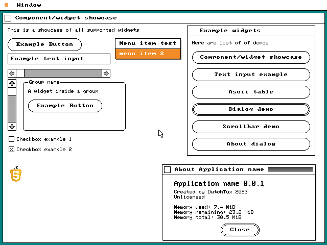

# JiYuAi a small UI kit for DOjS
A small UI kit to create simple UI apps



Look in minimal.js for minimal usage

## How to setup?
Just download version 1.10 of DOjS from https://github.com/SuperIlu/DOjS/releases/tag/v1.100
And extract all files to this folder and run jiyuai from DOS or Dosbox

### Using dosbox
The app is tested in with [Dosbox-staging](https://dosbox-staging.github.io/).

You can use the following configuration to run the JiYuAi:
```
[dosbox]
memsize=32

[cpu]
cputype=pentium_slow
cycles=max

[autoexec]
mount c .
c:
jiuai.bat
```

## TODO
* [ ] Maybe make UIApp a singelton object. (There is only 1 app.)
* [ ] Create textarea field
* [ ] only update parts of the screen that are needed.
* [ ] rename children to nodes (more in line with htmldom)
* [ ] beter event handling for mouse (like mouseIn, mouseOut, mouseOver)
* [ ] make a generic event handler system.

## CHANGELOG

### v0.0.2
* Added checkbox widget
* Added group widget
* Added image widget
* Give buttons rounded corners
* Give buttons a pressed in state
* Make window ascci table demo smaller

### v0.0.1
* First version
